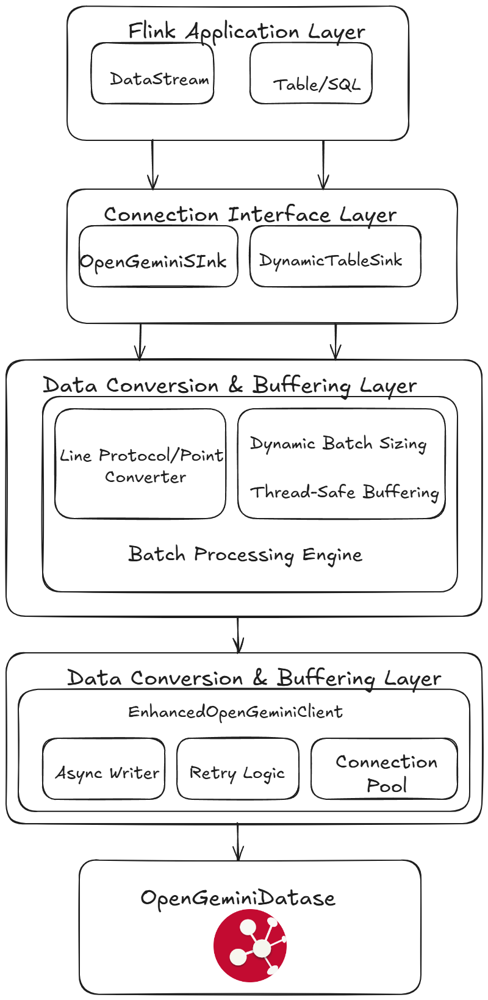

# OpenGemini Flink Connector - Design Document

## Table of Contents
- [Architecture Overview](#architecture-overview)
- [Design Principles](#design-principles)
- [Core Components](#core-components)
- [Data Flow Architecture](#data-flow-architecture)
- [State Management](#state-management)
- [Performance Design](#performance-design)
- [Extension Architecture](#extension-architecture)
- [Design Decisions](#design-decisions)

## Architecture Overview

The OpenGemini Flink Connector implements a layered architecture that bridges Apache Flink's streaming ecosystem with OpenGemini time-series database, prioritizing performance, fault tolerance, and extensibility.



## Design Principles

### 1. Performance First
- **Minimal Overhead**: Direct LineProtocol generation bypasses intermediate object creation
- **Batch Optimization**: Dynamic batch sizing adapts to system performance characteristics
- **Asynchronous Processing**: Non-blocking I/O prevents pipeline stalls

### 2. Fault Tolerance
- **State Persistence**: Integration with Flink's checkpoint mechanism ensures data durability
- **Graceful Degradation**: System continues operation despite partial failures
- **Recovery Semantics**: At-least-once delivery guarantees with idempotent operations

### 3. Extensibility
- **Interface-Based Design**: Clean separation between conversion logic and sink behavior
- **Configuration-Driven**: Runtime behavior modification without code changes
- **Plugin Architecture**: Support for custom converters and processing logic

### 4. Operational Excellence
- **Observability**: Comprehensive metrics integration with Flink's monitoring ecosystem
- **Debuggability**: Structured logging and performance profiling hooks
- **Maintainability**: Modular design with clear component boundaries

## Core Components

### OpenGeminiSink<T>

**Design Purpose**: Primary sink implementation serving as the central orchestrator for data processing and state management.

**Key Design Aspects**:

```java
public class OpenGeminiSink<T> extends RichSinkFunction<T> implements CheckpointedFunction {
    // Thread-safe batch management
    private transient Object batchLock;
    private transient List<String> currentBatch;
    
    // Dual converter strategy for performance optimization
    private boolean useDirectConversion;
    private OpenGeminiLineProtocolConverter<T> lineProtocolConverter;
    private OpenGeminiPointConverter<T> pointConverter;
    
    // Dynamic performance adaptation
    private transient int currentBatchSize;
    private transient int evaluationCounter;
    private transient long totalLatency;
}
```


**Thread Safety Design**:
- Uses `synchronized` blocks around `batchLock` for thread-safe batch operations
- Atomic operations for metrics collection
- Immutable configuration objects to prevent concurrent modification

**State Management Strategy**:
- Persists unbuffered data during checkpoints using Flink's `ListState`
- Implements recovery logic to handle data that was in-flight during failures
- Separates transient runtime state from persistent checkpoint state

### Data Conversion Architecture

**Design Challenge**: Balance between performance and compatibility while supporting future protocol evolution.

**Solution**: Dual-path conversion strategy with runtime selection

```java
// High-performance direct conversion
if (useDirectConversion) {
    lineProtocol = lineProtocolConverter.convertToLineProtocol(value, measurement);
} else {
    // Compatibility path through Point objects
    Point point = pointConverter.convertToPoint(value, measurement);
    lineProtocol = point.lineProtocol();
}
```

**LineProtocol Direct Generation**:
```java
public class SimpleOpenGeminiLineProtocolConverter<T> {
    // Builder pattern for flexible configuration
    private final Map<String, SerializableFunction<T, String>> tagExtractors;
    private final Map<String, SerializableFunction<T, Object>> fieldExtractors;
    private final SerializableFunction<T, Long> timestampExtractor;
    
    // Optimized string generation with minimal allocations
    public String convertToLineProtocol(T value, String measurement) {
        StringBuilder sb = new StringBuilder();
        // Direct protocol generation...
    }
}
```

### Table API Integration Design

**Architecture Goal**: Seamless integration with Flink's Table API while maintaining DataStream performance characteristics.

**Factory Pattern Implementation**:
```java
public class OpenGeminiDynamicTableSinkFactory implements DynamicTableSinkFactory {
    // Configuration validation and default value management
    // Field mapping interpretation
    // Sink instance creation with proper converter selection
}
```

**RowData Processing Strategy**:
- **Direct Conversion**: `RowDataToLineProtocolConverter` for optimal performance
- **Type Safety**: Compile-time type checking with runtime validation
- **Schema Evolution**: Support for dynamic schema changes through field mapping

## Data Flow Architecture

### Processing Pipeline

1. **Ingestion Phase**
   ```
   Flink Record → invoke(T value, Context context)
                ↓
   Value Validation & Null Check
                ↓
   Converter Selection (Direct vs Point-based)
                ↓
   LineProtocol Generation
   ```

2. **Buffering Phase**
   ```
   LineProtocol String → Thread-Safe Buffer Addition
                      ↓
   Flush Condition Evaluation (Size + Time)
                      ↓
   Batch Preparation & Buffer Swap
   ```

3. **Writing Phase**
   ```
   Batch → Async Write Request
         ↓
   Completion Callback → Metrics Update + Error Handling
                               ↓
   Dynamic Batch Size Evaluation
   ```

### Checkpoint Integration

**State Snapshot Strategy**:
```java
@Override
public void snapshotState(FunctionSnapshotContext context) throws Exception {
    synchronized (batchLock) {
        try {
            flush(); // Attempt to clear buffer
        } catch (Exception e) {
            // Save failed data to checkpoint state
            log.error("Flush failed during checkpoint, saving to state", e);
        }
        
        // Persist any remaining unbuffered data
        checkpointedState.clear();
        if (!currentBatch.isEmpty()) {
            checkpointedState.add(new ArrayList<>(currentBatch));
        }
    }
}
```

**Recovery Strategy**:
- Restore buffered data from checkpoint state
- Attempt immediate write of recovered data
- Continue normal processing after successful recovery

## State Management

### Checkpoint State Design

**State Structure**:
- **Buffered Data**: `ListState<List<String>>` containing LineProtocol strings
- **Metadata**: Minimal state to reduce checkpoint size
- **Recovery Logic**: Idempotent operations for safe replay

**State Evolution Considerations**:
- Version compatibility for checkpoint format
- Migration strategies for schema changes
- Backward compatibility maintenance

### Memory Management

**Buffer Lifecycle**:
```java
// Buffer initialization with appropriate sizing
currentBatch = new ArrayList<>(configuration.getBatchSize());

// Thread-safe buffer operations
synchronized (batchLock) {
    currentBatch.add(lineProtocol);
    if (shouldFlush()) {
        flush();
    }
}

// Memory cleanup during flush
List<String> toFlush = new ArrayList<>(currentBatch);
currentBatch.clear();
```

**Memory Optimization Strategies**:
- Pre-sized collections based on batch configuration
- Immediate buffer clearing after successful writes
- Minimal object retention during checkpoints

## Performance Design

### Dynamic Batch Sizing Algorithm

**Performance Adaptation Logic**:
```java
private void evaluateBatchSize() {
    evaluationCounter++;
    if (evaluationCounter >= EVALUATION_INTERVAL) {
        double avgLatency = totalLatency / EVALUATION_INTERVAL;
        
        if (avgLatency < INCREASE_THRESHOLD && errorInWindow == 0) {
            increaseBatchSize(); // Multiplicative increase: ×1.2
        } else if (avgLatency > DECREASE_THRESHOLD || errorInWindow > 0) {
            decreaseBatchSize(); // Multiplicative decrease: ×0.7
        }
        
        resetEvaluationWindow();
    }
}
```

**Algorithm Properties**:
- **AIMD Approach**: Additive increase, multiplicative decrease for stability
- **Error-Aware**: Considers both latency and error rates
- **Bounded**: Respects minimum and maximum batch size limits
- **Adaptive**: Responds to changing system conditions

### Conversion Optimization

**String Building Optimization**:
```java
// Efficient LineProtocol construction
StringBuilder sb = new StringBuilder();
sb.append(measurement);

// Direct tag appending without intermediate allocations
for (Map.Entry<String, SerializableFunction<T, String>> entry : tagExtractors.entrySet()) {
    String tagValue = entry.getValue().apply(value);
    if (tagValue != null) {
        sb.append(',').append(entry.getKey()).append('=').append(escape(tagValue));
    }
}
```

**Memory Allocation Patterns**:
- StringBuilder reuse where possible
- Minimal intermediate object creation
- Efficient string escaping implementation

### Metrics Integration Design

**Metrics Architecture**:
```java
// Hierarchical metric organization
MetricGroup metricGroup = getRuntimeContext()
    .getMetricGroup()
    .addGroup("opengemini")
    .addGroup("sink");

// Performance metrics
this.writeLatency = metricGroup.histogram("writeLatency", 
    new DescriptiveStatisticsHistogram(1000));

// Operational metrics
this.totalPointsWritten = metricGroup.counter("totalPointsWritten");

// System health metrics
metricGroup.gauge("currentBatchSize", () -> currentBatch.size());
```

## Extension Architecture

### Converter Extension Points

**Interface Design**:
```java
// Primary conversion interface
public interface OpenGeminiLineProtocolConverter<T> extends Serializable {
    String convertToLineProtocol(T value, String measurement);
}

// Compatibility conversion interface
public interface OpenGeminiPointConverter<T> extends Serializable {
    Point convertToPoint(T value, String measurement);
}
```

**Extension Patterns**:
- **Custom Data Types**: Implement converter interfaces for domain-specific objects
- **Protocol Adaptation**: Support for future OpenGemini protocol versions
- **Performance Tuning**: Specialized converters for high-throughput scenarios

### Configuration Extension

**Extensible Configuration Design**:
```java
public class OpenGeminiSinkConfiguration<T> {
    // Core configuration with builder pattern
    public static class Builder<T> {
        // Extensible builder for custom configuration options
        public Builder<T> customOption(String value) {
            // Extension point for additional configuration
        }
    }
}
```

### Custom Sink Behavior

**Inheritance-Based Extension**:
```java
public class CustomOpenGeminiSink<T> extends OpenGeminiSink<T> {
    @Override
    protected boolean shouldFlush() {
        // Custom flush logic
        return customCondition() || super.shouldFlush();
    }
    
    @Override
    protected void registerMetrics() {
        super.registerMetrics();
        // Additional custom metrics
    }
}
```

## Design Decisions

### Technology Choices

**Flink SinkFunction vs New Sink API**
- **Decision**: Use RichSinkFunction + CheckpointedFunction
- **Rationale**:
    - OpenGemini doesn't support transactional rollback (no exactly-once benefit)
    - SinkFunction provides sufficient functionality for at-least-once semantics
    - Simpler implementation and broader Flink version compatibility
- **Trade-offs**: Missing some advanced features of new Sink API

**Synchronous vs Asynchronous Processing**
- **Decision**: Hybrid approach with async writes but sync checkpoints
- **Rationale**:
    - Async writes for performance during normal operation
    - Sync writes during checkpoints for data consistency guarantees
- **Implementation**: CompletableFuture-based async API with timeout handling

**Direct LineProtocol vs Point-based Conversion**
- **Decision**: Support both with runtime selection
- **Rationale**:
    - Direct conversion for optimal performance
    - Point-based conversion for compatibility and debugging
- **Migration Path**: Interface abstraction enables future protocol support

### Performance Trade-offs

**Batch Size vs Latency**
- **Approach**: Dynamic adaptation based on observed performance
- **Metrics**: Average write latency and error rate
- **Bounds**: Configurable minimum and maximum batch sizes


### Error Handling Strategy

**Retry Policy Design**:
- Retry with backoff

**State Recovery Strategy**:
- **Checkpoint Success**: All data persisted, clean state
- **Checkpoint Failure**: Unbuffered data saved to state
- **Recovery**: Attempt to write recovered data, continue processing
